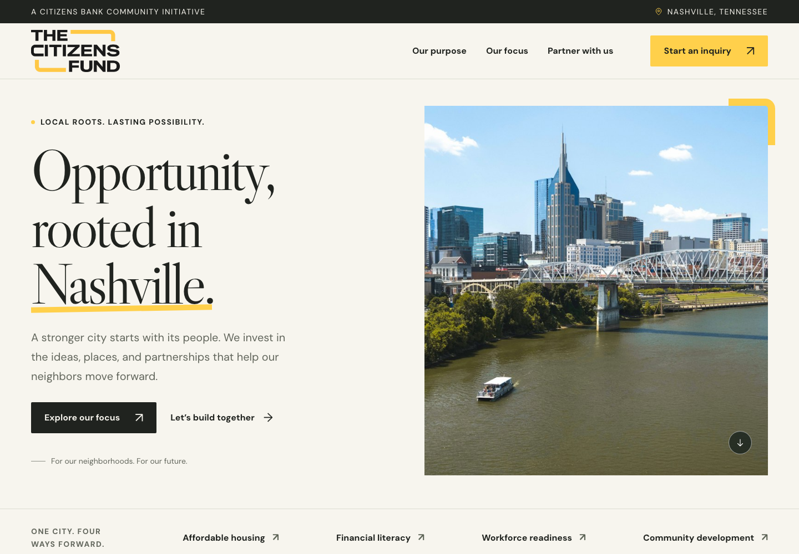

# The Citizens Fund — website redesign

A complete, responsive redesign of the Citizens Bank Foundation page, presented under its existing **The Citizens Fund** identity. Created September 15, 2026.

**[View the live website preview](https://aces40love.github.io/The-Citizens-Fund/)**

[View the complete desktop design](previews/desktop.png) · [View the mobile design](previews/mobile.png)

## Open the website

From GitHub, choose **Code → Download ZIP**, then extract the downloaded folder.

**Double-click `index.html` in this folder.** Everything needed to view the website is included locally, including photographs, fonts, styles, and interactions. No install or account is needed.

For a local web preview, run `npm start` in this folder and visit **http://127.0.0.1:4173**. Node.js is the only requirement for the preview server. It binds only to your Mac, not your network.

## What is included

- A redesigned homepage with real Nashville photography, the original Fund logo, refined typography, and its black-and-gold palette.
- Responsive desktop, tablet, and phone layouts; accessible mobile navigation; working section links and expandable FAQs.
- Four focus areas: Affordable Housing, Financial Literacy, Workforce Readiness, and Community Development.
- A four-step inquiry flow that preserves the source page’s questions, validates required answers, handles conditional fields, and offers a review and downloadable copy.
- Locally bundled images and fonts. The preview makes no analytics or third-party asset requests.
- Keyboard navigation, visible focus indicators, reduced-motion support, semantic headings, descriptive image text, and native modal focus management.

## Inquiry behavior

The new form is a functioning **local inquiry preparation flow**, not a live submission service. Answers remain in page memory until the visitor deliberately downloads a text copy; refreshing closes the draft. No inquiry information is sent or saved by the site.

The review page links to the original Fund application for the actual submission. It does not automatically transfer form answers. The source page’s Gravity Forms installation has not been altered or connected to this redesign.

## Files

| File | Purpose |
| --- | --- |
| `index.html` | Complete website, including the inquiry dialog |
| `styles.css` | Design system and responsive layouts |
| `site.js` | Mobile navigation and photo-credit disclosure |
| `inquiry.js` | Inquiry validation, review, and download behavior |
| `inquiry-dialog.html` | Original standalone dialog markup for easier reuse; the runnable copy is embedded in `index.html` |
| `assets/` | Original logo, local photographs, fonts, and license/source details |
| `references/` | Content research notes; the original captured page is kept locally and excluded from GitHub |
| `previews/` | Desktop, mobile, and inquiry screenshots from local QA |
| `tests/browser-check.mjs` | Repeatable browser and accessibility checks |
| `server.mjs` | Optional dependency-free local preview server |

## Content and publishing

The source was https://cbnbankprod.wpenginepowered.com/citizens-bank-foundation/. Its current identity, mission, focus areas, and inquiry fields guided the redesign. New headline and supporting copy are proposed editorial copy.

The original Workforce Readiness paragraph repeated the Affordable Housing paragraph. This redesign uses general workforce copy; the Fund should confirm specific program language before publication. No grant totals, beneficiary claims, founding date, donation processor, deadlines, eligibility rules, or foundation tax status have been invented. See `references/content-notes.md`.

The public design preview is hosted on GitHub Pages. Updates pushed to `main` automatically publish the website files and assets through `.github/workflows/pages.yml`; research files, tests, and local inquiry drafts are excluded from the deployment. A production launch still requires confirmation of the final copy and connecting the inquiry to the Fund’s approved submission system. Remove the preview’s `noindex, nofollow` metadata when the final site is approved for indexing.

Photograph credits and licenses are in `assets/asset-sources.md`. The original Fund logo came from the supplied website. Font licenses are included in `assets/fonts/`.

## Development checks

Verified locally: **17/17 browser checks passed** at widths of 1440, 768, 390, and 320 pixels. Automated axe checks found no WCAG A/AA violations in the tested page, dialog, and review states. Direct file opening, the full inquiry journey, local download, focus restoration, and the absence of external requests were also verified. This is automated coverage plus a Safari visual review, not an accessibility certification. Results are recorded in `previews/test-results.json`.

`npm run check` validates script syntax. For the browser checks, run `npm install`, start the local server with `npm start`, then run `npm test` in another terminal. If Playwright’s browser is not installed, run `npx playwright install chromium` first. Browser tooling is used only for development; the website has no runtime package dependencies.
